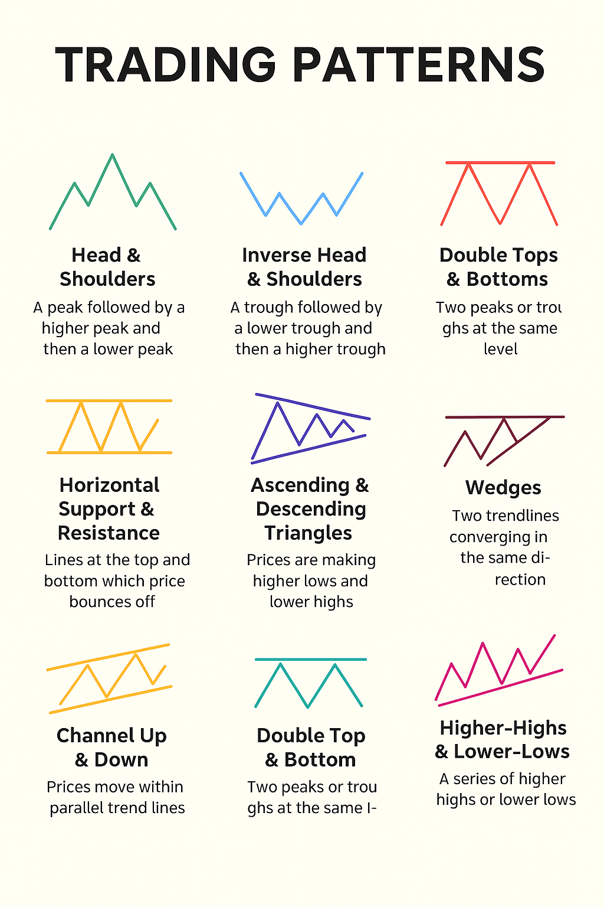

# 📈 Trading Pattern Detection & Visualization

## 🧠 Description

FinPattern is a Python-based project that helps you analyze financial market data and detect common trading patterns easily. It focuses on identifying well-known chart patterns such as **Head and Shoulders**, **Double Tops and Bottoms**, and **Support and Resistance** levels using **OHLCV** data (Open, High, Low, Close, Volume).

Built using Pandas and NumPy, FinPattern provides fast and accurate analysis in a simple and user-friendly way. Whether you’re new to trading or already experienced, FinPattern helps you understand market trends, recognize price movement patterns, and make better trading decisions.

## 💡 Why FinPattern ?

- **All-in-One Solution:** FinPattern brings together different trading pattern detections in one project — so you don’t need multiple tools to analyze your data.  
- **Fast and Efficient:** Built with smart data processing techniques, FinPattern can handle large amounts of market data quickly and accurately.  
- **Flexible and Customizable:** You can easily adjust settings like the analysis window size to control how sensitive the pattern detection should be.  
- **Smart Market Insights:** FinPattern helps you spot potential trading opportunities more clearly, supporting smarter and more confident investment decisions.

## 💹 Trading Patterns: Technical Overview

1. **Head & Shoulders / Inverse Head & Shoulders**  
   This pattern has three peaks — a higher middle peak (the head) and two smaller side peaks (the shoulders).  
   It indicates a possible reversal in the price trend.  
   The inverse version appears upside down and suggests a potential upward reversal after a decline.

2. **Multiple Tops & Bottoms (Horizontal Range)**  
   Prices repeatedly move between two horizontal levels without breaking out.  
   This shows market indecision where buyers and sellers are evenly matched.

3. **Horizontal Support & Resistance**  
   Support is a price level where a downtrend tends to pause due to demand.  
   Resistance is a level where an uptrend tends to pause due to selling pressure.  
   These levels help identify potential entry and exit points.

4. **Ascending & Descending Triangles**  
   These patterns form when prices move within a narrowing triangle.  
   An ascending triangle usually indicates potential upward movement, while a descending triangle often signals a downward breakout.

5. **Wedges**  
   Formed by two converging trend lines, wedges suggest a potential breakout.  
   A rising wedge often leads to a downward breakout, while a falling wedge can lead to an upward breakout.

6. **Channel Up & Down**  
   Prices move between two parallel lines, forming an upward or downward channel.  
   It helps traders visualize consistent price movement within defined limits.

7. **Double Top & Bottom**  
   When prices reach the same high or low level twice and fail to break through, it indicates a potential trend reversal.  
   Double tops usually signal a bearish reversal, while double bottoms suggest a bullish reversal.

8. **Trend Line Support & Resistance**  
   Diagonal lines connecting higher lows (support) or lower highs (resistance) show the trend direction.  
   They help identify when the market may continue or reverse its direction.

9. **Higher Highs & Lower Lows**  
   A series of higher highs and higher lows indicates an uptrend, while lower highs and lower lows indicate a downtrend.  
   This pattern helps confirm the strength and direction of the market trend.
   
## 📊 Trading Patterns Overview

  

  <b>Happy Trading!</b>

